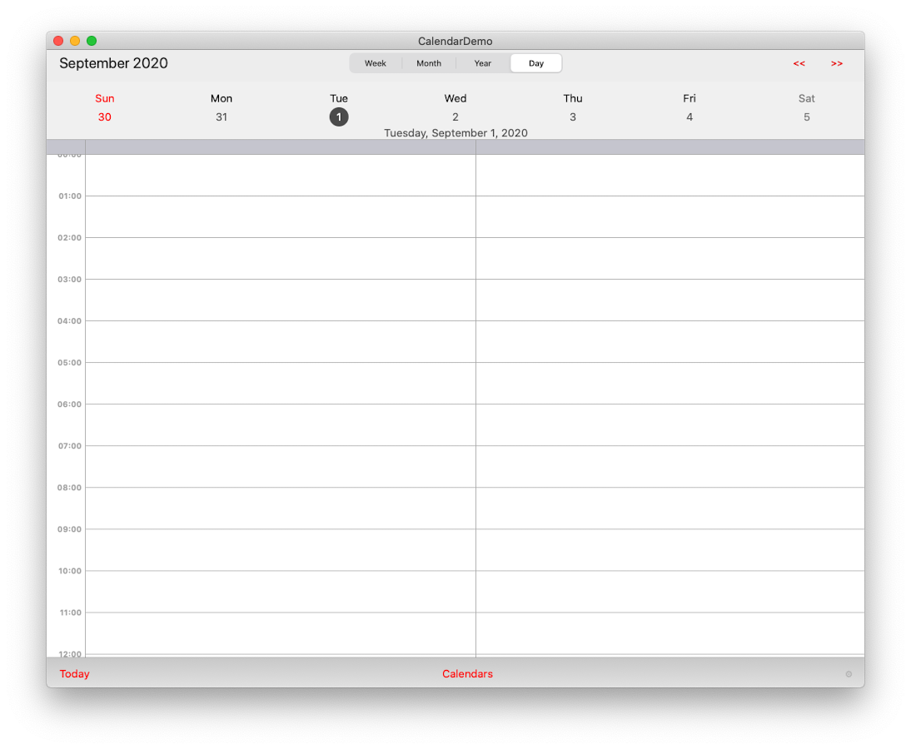
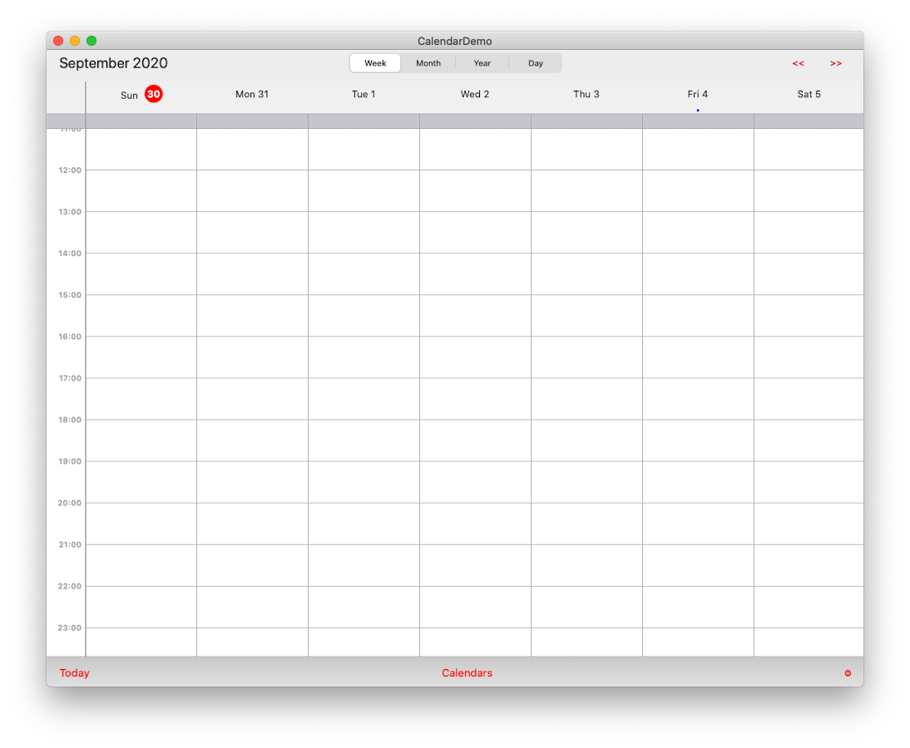
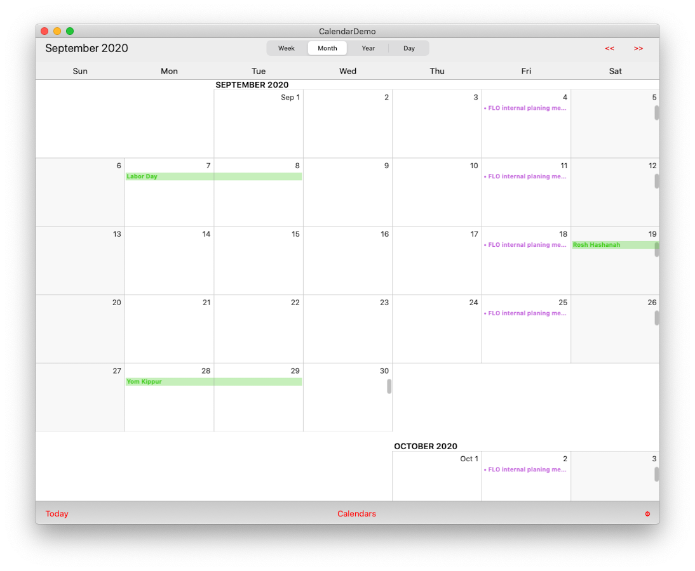
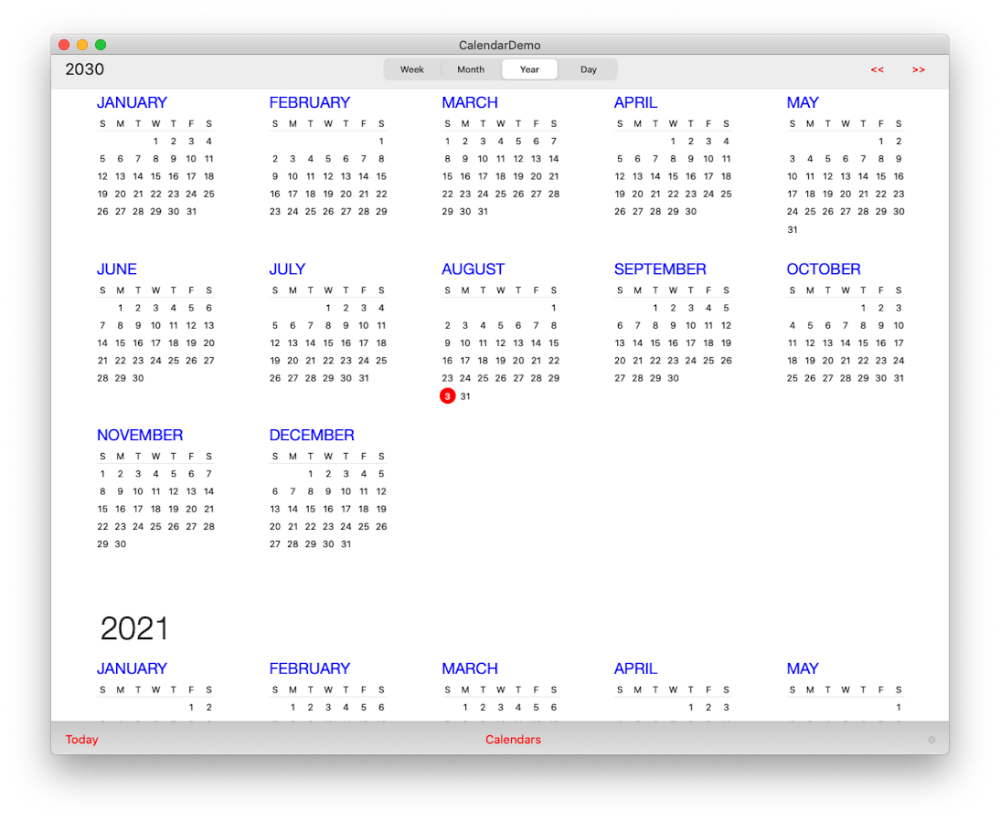
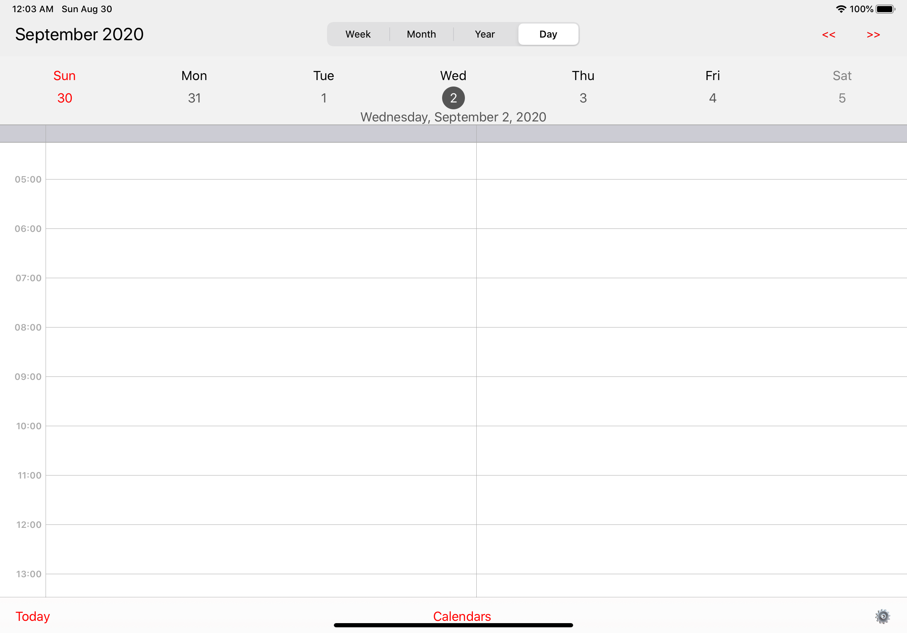
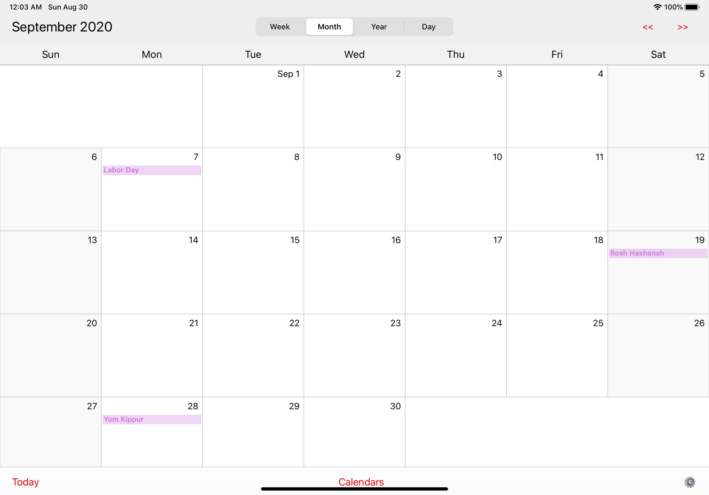
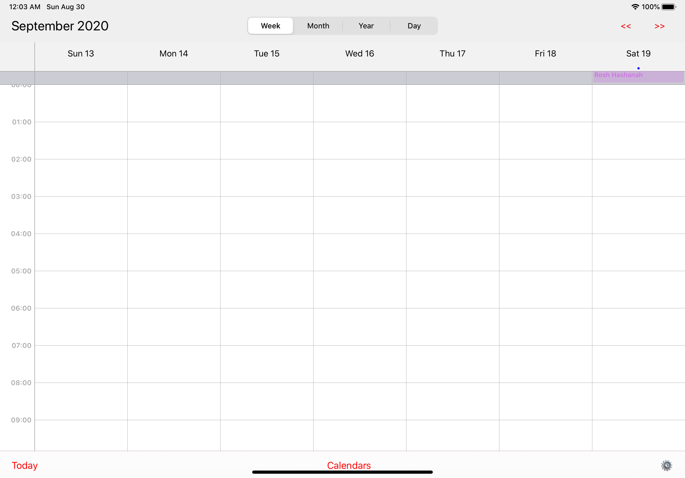
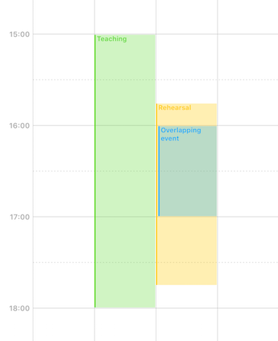
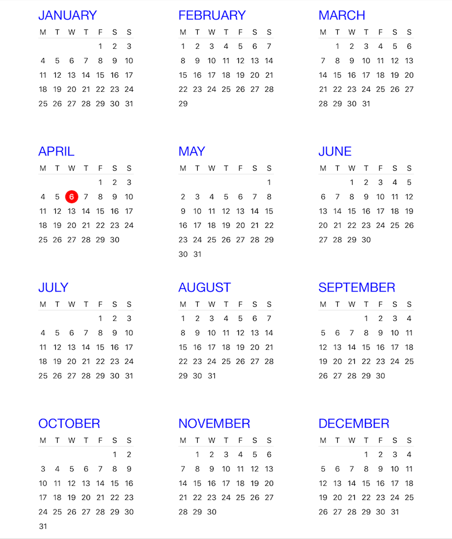

# Universal Calendar inspired from [Calendar](https://github.com/jumartin/Calendar) (Julien Martin)

[](http://cocoapods.org/pods/CalendarLib)
[](https://github.com/Carthage/Carthage)
[](http://cocoapods.org/pods/CalendarLib)
[](http://cocoapods.org/pods/CalendarLib)

Universal Calendar is a set of views and controllers for displaying and scheduling events on iOS and OSX.

**Warning:**

**As some people may have noticed, this project has not got any update recently, and a lot of issues / pull requests remain unanswered.
I’m very sorry for that, but I don’t have any time at the moment to take care of this repo, being very busy with other projects.
I may come back to it in the future, but meanwhile, please don’t expect any update soon.**

**Thanks anyway to all the contributors!**

#### OSX





#### iOS






## Features

- Create and schedule events with iCal-like views and controllers
- 3 kinds of views are available (a day planner view, a month planner view and a year view)
- Scroll infinitely through days / months, or restrict scrolling to a given date range
- Restrict range of displayed hours in the day planner view
- Page through weeks in the day planner view or months in the month planner view 
- Use a standard view for event cells or create your own custom views
- Easily customize appearance and layout (date format, colors, fonts, size of headers, number of visible days...)
- Create events by tap-and-hold on the view
- Drag-and-drop events to another date or time
- Scroll through days / months while dragging
- Specialized controllers for EventKit data source but can easily work with any custom event provider 
- Background event loading for the EventKit controllers
- Ability to show an activity indicator for days while events are loading
- Restrict ability to create or move events to certain dates through datasource protocol methods
- Zoom in/out the day planner view to increase or decrease the height of hour slots
- Dim certain time ranges in the day planner view

## Compatibility

iPad / iPhone with iOS 8 or higher.

## Installation

### Carthage
Add this to Cartfile

```ruby
github "haithngn/Calendar" "master"
```
```ruby
$ carthage update
```

## Getting started

1.  If you want to use EventKit as a data source, create an instance of `MGCDayPlannerEKViewController` or `MGCMonthPlannerEKViewController`, or subclass them for your own needs.
	
	Don't forget to add the following frameworks to the project:
	
	- **EventKit.framework**
	- **EventKitUI.framework**
	
2.  If you want to use another event provider, subclass one of `MGCDayPlannerViewController` or `MGCMonthPlannerViewController` and implement the data source protocol methods.

3.  If you want to use a custom event cell, subclass `MGCEventView` or `MGCStandardEventView` and register the class with the day / month planner view.
	
## License

CalendarLib is available under the MIT license. See the LICENSE file.

## Contribution
+ Author: [TriTranDev](https://github.com/TriTranDev)
+ Author: [Vỹ Nguyễn](https://github.com/VyNguyen0102)

## Change-log

A summary of each CalendarLib release can be found in the [CHANGELOG](CHANGELOG.md). 
